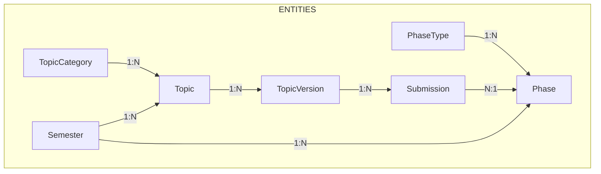
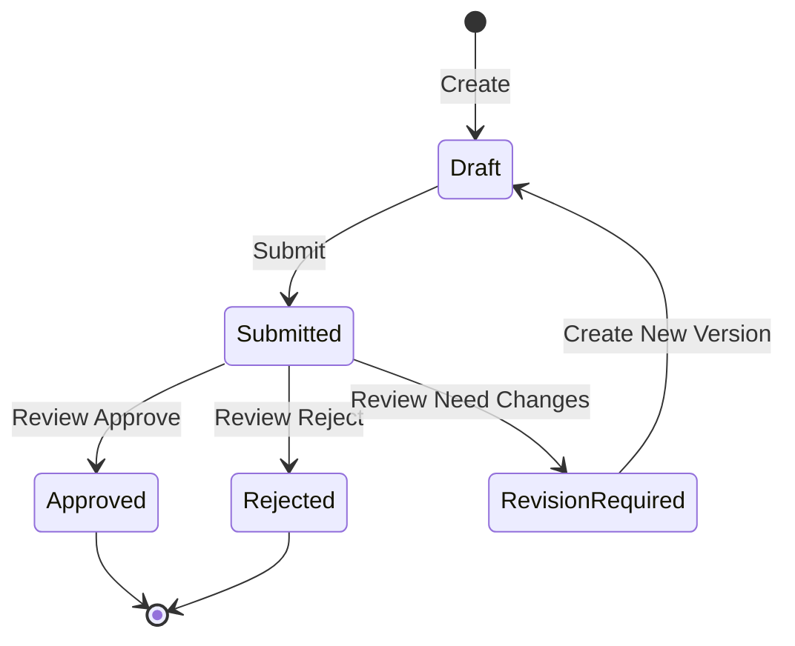

# 📊 WORKFLOW HỆ THỐNG CAPSTONE MANAGEMENT

## 🧭 Tổng quan

- Hệ thống quản lý luồng: Topic → TopicVersion → Submission → Review
- Quản trị cấu hình theo học kỳ (Semester) và giai đoạn (Phase/PhaseType)
- Phân quyền RBAC: Administrator, Moderator, Supervisor, Reviewer
- Xác thực JWT Bearer; tài liệu Swagger khi chạy Development

## 🔐 Authentication & Authorization

- Đăng nhập để lấy token:
  - POST `/api/auth/login`
  - Body:
    ```json
    {
      "emailOrUsername": "user@example.com",
      "password": "SecurePass123"
    }
    ```
  - Response mẫu:
    ```json
    {
      "statusCode": 200,
      "success": true,
      "data": {
        "token": "eyJhbGciOi...",
        "expiresIn": 3600,
        "user": {
          "id": 1,
          "email": "user@example.com",
          "roles": ["Supervisor"]
        }
      },
      "message": "Đăng nhập thành công"
    }
    ```
- Tạo tài khoản (chỉ Admin/qua hệ thống):
  - POST `/api/auth/register` (yêu cầu role `Administrator`)
- Gọi API kèm `Authorization: Bearer <token>`

- Kiểm tra role:

  - GET `/api/account/my-user-roles`
  - GET `/api/account/user-roles/{userId}`

- Các role sử dụng trong hệ thống:
  - `Administrator`, `Moderator`, `Supervisor`, `Reviewer`

## 🧱 Kiến trúc dữ liệu



- Trạng thái TopicVersion: `Draft, Submitted, UnderReview, Approved, Rejected, RevisionRequired`
- Trạng thái Submission: `Pending, UnderReview, Completed, RevisionRequired`
- PhaseType: `Submit, Review, Ongoing` (dùng điều phối vòng đời Submission)

## 📦 Chuẩn response & phân trang

- Chuẩn response:

  ```json
  {
    "statusCode": 200,
    "success": true,
    "data": {},
    "errors": [],
    "message": "..."
  }
  ```

- Query phân trang (áp dụng cho nhiều list):
  - Tham số: `pageNumber`, `pageSize`, `keyword?`
  - Mặc định: `pageNumber=1`, `pageSize=10`
  - Response thường kèm `totalRecord` để client tính tổng trang

## 🏗️ Setup hệ thống

### 1) Topic Category (Admin)

- Tạo: POST `/api/topic-category/create`
  ```json
  { "name": "AI", "description": "Chủ đề AI" }
  ```
- Danh sách: GET `/api/topic-category/all`
- Cập nhật: PUT `/api/topic-category/update`
  ```json
  { "id": 1, "name": "AI/ML", "description": "Cập nhật" }
  ```
- Xóa: DELETE `/api/topic-category/delete/{id}`

### 2) Semester (Admin)

- Tạo: POST `/api/semester/create`
  ```json
  { "name": "Fall 2025", "startDate": "2025-09-01", "endDate": "2025-12-31" }
  ```
- Danh sách: GET `/api/semester/all`
- Chi tiết: GET `/api/semester/detail/{id}`
- Cập nhật: PUT `/api/semester/update`
- Xóa: DELETE `/api/semester/delete/{id}`

### 3) PhaseType (Admin)

- Tạo: POST `/api/phase-type/create`
  ```json
  { "name": "Submit", "description": "Giai đoạn nộp bài" }
  ```
- Danh sách:
  - GET `/api/phase-type/all` (tất cả)
  - GET `/api/phase-type/all-paging?pageNumber=1&pageSize=10&keyword=...`
- Chi tiết: GET `/api/phase-type/detail/{id}`
- Cập nhật: PUT `/api/phase-type/update`
- Xóa: DELETE `/api/phase-type/delete/{id}`

### 4) Phase (Admin)

- Tạo: POST `/api/phase/create`
- Cập nhật: PUT `/api/phase/update`
- Xóa: DELETE `/api/phase/delete/{id}`
- Danh sách (paging/filter theo `semesterId`): GET `/api/phase/list`
- Chi tiết: GET `/api/phase/detail/{id}`

## 🧩 Vòng đời Topic và TopicVersion

### 1) Tạo Topic (Supervisor)

- POST `/api/topic/create`
  ```json
  {
    "title": "Ứng dụng di động",
    "description": "Mô tả",
    "objectives": "Mục tiêu",
    "categoryId": 1,
    "semesterId": 1,
    "maxStudents": 2,
    "methodology": "Phương pháp",
    "expectedOutcomes": "Kết quả",
    "requirements": "Yêu cầu",
    "documentUrl": "https://..."
  }
  ```
- Lấy danh sách (paging/filter): GET `/api/topic/list?semesterId=&categoryId=&pageNumber=&pageSize=`
- Chi tiết: GET `/api/topic/detail/{id}`
- Cập nhật (Supervisor/Admin): PUT `/api/topic/update`
- Xóa (Supervisor/Admin): DELETE `/api/topic/delete/{id}`
- Phê duyệt Topic (Admin/Moderator): POST `/api/topic/approve/{id}`
- Topics của tôi (Supervisor): GET `/api/topic/my-topics`

### 2) Vòng đời TopicVersion



- Tạo version (Supervisor): POST `/api/topic-version/create`
- Cập nhật version Draft (Supervisor): PUT `/api/topic-version/update`
- Lịch sử versions (paging): GET `/api/topic-version/history/{topicId}?pageNumber=&pageSize=`
- Chi tiết version: GET `/api/topic-version/detail/{versionId}`
- Submit version (Draft→Submitted): POST `/api/topic-version/submit`
  ```json
  { "versionId": 10 }
  ```
- Review version (Admin/Reviewer): POST `/api/topic-version/review`
  ```json
  { "versionId": 10, "status": 4, "reviewNote": "Bổ sung phương pháp" }
  ```
  - status: Approved(4) | Rejected(5) | RevisionRequired(6)
- Xóa version Draft (Supervisor/Admin): DELETE `/api/topic-version/delete/{versionId}`

## 📨 Vòng đời Submission

### Nguyên tắc

- Chỉ tạo submission từ TopicVersion đã Approved
- Phase của Submission phải thuộc cùng Semester với Topic
- Submit/Resubmit phải trước deadline của Phase
- Trạng thái:
  - Pending → UnderReview → Completed
  - UnderReview → Completed
  - RevisionRequired → UnderReview (khi Resubmit)
- Round tăng khi Resubmit

### Endpoints

- Tạo (Supervisor): POST `/api/submission/create`
  ```json
  {
    "topicVersionId": 10,
    "phaseId": 5,
    "documentUrl": "https://...",
    "additionalNotes": "..."
  }
  ```
- Cập nhật (Pending/RevisionRequired): PUT `/api/submission/update`
- Submit (Pending→UnderReview): POST `/api/submission/submit`
  ```json
  { "id": 123 }
  ```
- Resubmit (RevisionRequired→UnderReview, +round): POST `/api/submission/resubmit`
  ```json
  { "id": 123 }
  ```
- Chi tiết: GET `/api/submission/detail/{id}`
- Danh sách (paging/filter): GET `/api/submission/list`
  - Query gợi ý: `topicVersionId`, `phaseId`, `semesterId`, `status`, `pageNumber`, `pageSize`

## 👥 Phân công Reviewer

### Luồng

- Admin/Moderator chọn Submission và phân công Reviewer
- Có thể phân công 1 hoặc nhiều reviewer (primary/secondary)
- Hệ thống hỗ trợ:
  - Gợi ý reviewer khả dụng theo workload/skill
  - Tự động phân công dựa trên tiêu chí (skill matching, workload, performance)
  - Thống kê workload reviewer

### Endpoints

- Phân công 1 reviewer (Admin/Moderator): POST `/api/reviewer-assignments`
  ```json
  {
    "submissionId": 123,
    "reviewerId": 88,
    "assignmentType": 1,
    "deadline": "2025-10-01T00:00:00Z",
    "skillMatchScore": 3.5,
    "notes": "Primary"
  }
  ```
- Phân công nhiều (Admin/Moderator): POST `/api/reviewer-assignments/bulk`
  ```json
  {
    "assignments": [{ ... }, { ... }]
  }
  ```
- Reviewer khả dụng (Admin/Moderator): GET `/api/reviewer-assignments/available/{submissionId}`
- Danh sách assignment theo submission: GET `/api/reviewer-assignments/by-submission/{submissionId}`
- Danh sách assignment theo reviewer: GET `/api/reviewer-assignments/by-reviewer/{reviewerId}`
- Cập nhật trạng thái assignment: PUT `/api/reviewer-assignments/{assignmentId}/status`
  - Body: `AssignmentStatus` (enum)
- Hủy assignment (Admin/Moderator): DELETE `/api/reviewer-assignments/{assignmentId}`
- Thống kê workload (Admin/Moderator): GET `/api/reviewer-assignments/workload?semesterId=`
- Auto-assign (Admin/Moderator): POST `/api/reviewer-assignments/auto-assign`
  ```json
  {
    "submissionId": 123,
    "numberOfReviewers": 1,
    "assignmentType": 1,
    "deadline": "2025-10-01T00:00:00Z",
    "minimumSkillMatchScore": 2.0,
    "maxWorkload": 10,
    "prioritizeHighPerformance": true,
    "topicSkillTags": ["AI", "NLP"]
  }
  ```
- Gợi ý reviewer (Admin/Moderator): GET `/api/reviewer-assignments/recommendations/{submissionId}?minSkillScore=2.0&maxWorkload=10`
- Phân tích match: GET `/api/reviewer-assignments/analyze/{reviewerId}/{submissionId}`

## 🧑‍💻 Permission Matrix (tóm tắt)

- Topic Category, Semester, PhaseType, Phase:
  - Tạo/Cập nhật/Xóa: **Admin**
  - Xem: **Auth**
- Topic:
  - Tạo/Xem của tôi: **Supervisor**
  - Cập nhật/Xóa: **Supervisor/Admin**
  - Duyệt: **Admin/Moderator**
  - Danh sách/Chi tiết: **Auth**
- Topic Version:
  - Tạo/Cập nhật/Submit/Xóa Draft: **Supervisor**
  - Review: **Admin/Reviewer**
  - Lịch sử/Chi tiết: **Auth**
- Submission:
  - Tạo/Cập nhật/Submit/Resubmit: **Supervisor**
  - Danh sách/Chi tiết: **Auth**
- Reviewer Assignment:
  - Tạo/Hủy/Bulk/Auto/Workload/Available/Recommendations: **Admin/Moderator**
  - Xem by-submission/by-reviewer: **Auth**
  - Cập nhật trạng thái: **Auth** (thường do Admin/Moderator điều phối)

## 🧪 Ví dụ gọi API nhanh (cURL)

- Đăng nhập:

  ```bash
  curl -X POST https://<base-url>/api/auth/login \
    -H "Content-Type: application/json" \
    -d '{"emailOrUsername":"admin@capbot.com","password":"Admin@123"}'
  ```

- Tạo Topic (Supervisor):

  ```bash
  curl -X POST https://<base-url>/api/topic/create \
    -H "Content-Type: application/json" \
    -H "Authorization: Bearer <token>" \
    -d '{"title":"Đề tài A","categoryId":1,"semesterId":1,"maxStudents":2}'
  ```

- Submit Topic Version:

  ```bash
  curl -X POST https://<base-url>/api/topic-version/submit \
    -H "Authorization: Bearer <token>" \
    -H "Content-Type: application/json" \
    -d '{"versionId": 10}'
  ```

- Phân công reviewer (Admin/Moderator):
  ```bash
  curl -X POST https://<base-url>/api/reviewer-assignments \
    -H "Authorization: Bearer <token>" \
    -H "Content-Type: application/json" \
    -d '{"submissionId":123,"reviewerId":88,"assignmentType":1}'
  ```

## ⚙️ Cấu hình & vận hành

- Swagger UI (Development): truy cập trang chủ (`/`) → “Cap Bot Capstone API v1”
- JWT: cấu hình trong `appsettings.json` (`JwtSettings:Issuer`, `Audience`, `SecretKey`)
- Rate limit: tối đa 10 request/phút theo user/host
- CORS: `*` (tất cả origin), cho phép mọi method/header
- OData: enable route `/odata` (chưa expose entity set trong `EdmModelBuilder`, không ảnh hưởng REST APIs)
